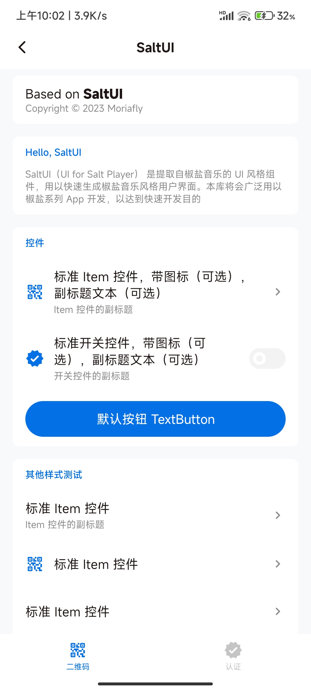

# SaltUI

SaltUI（UI for Salt Player） 是提取自[椒盐音乐](https://github.com/Moriafly/SaltPlayerSource) UI 风格、适用于 Android Jetpack Compose 的组件，用以快速生成椒盐音乐风格用户界面。

本库将会广泛用以椒盐系列 App 开发，以达到快速开发目的。

**详细介绍和文档**请访问（正在改进）：https://github.com/Moriafly/SaltUI/wiki 。



## 使用

### 1. 项目 Gradle 添加 JitPack 依赖

```groovy
allprojects {
    repositories {
        // ...
        maven { url 'https://jitpack.io' }
    }
}
```

### 2. 要使用的模块下添加 SaltUI 依赖

最新版本⬇️⬇️⬇️

[](https://jitpack.io/#Moriafly/SaltUI)

```groovy
dependencies {
    // ...
    // 将 <VERSION> 替换为具体的版本号，如 0.1.0-dev51
    // 即 implementation 'com.github.Moriafly:SaltUI:0.1.0-dev51'
    // 推荐使用上方最新版本或稳定版本（若有）
    implementation 'com.github.Moriafly:SaltUI:<VERSION>'
}
```

## 贡献

[贡献者行为准则](CODE_OF_CONDUCT.md)

## 协议

详见 [LICENSE](LICENSE) 。

使用开源库：AOSP、Kotlin 等，如 Web 来自 Google Accompanist ，详细请见具体文件注释说明。

```
Copyright 2023-2024 Moriafly

Licensed under the Apache License, Version 2.0 (the "License");
you may not use this file except in compliance with the License.
You may obtain a copy of the License at

     http://www.apache.org/licenses/LICENSE-2.0

Unless required by applicable law or agreed to in writing, software
distributed under the License is distributed on an "AS IS" BASIS,
WITHOUT WARRANTIES OR CONDITIONS OF ANY KIND, either express or implied.
See the License for the specific language governing permissions and
limitations under the License.
```

## 星星历史

[](https://star-history.com/#Moriafly/SaltUI&Date)
